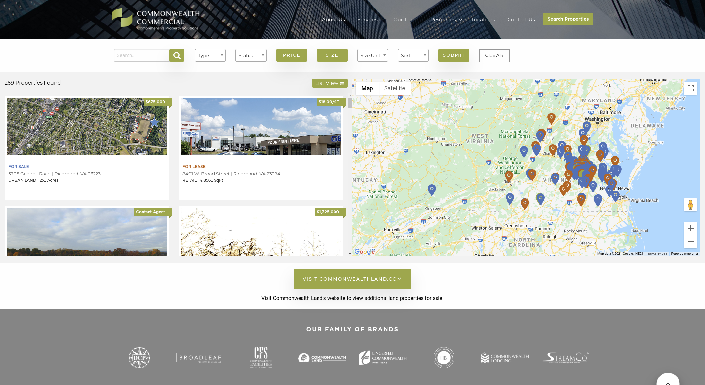

## {{ title }}

Commonwealth Commercial had very big ambitions with the site. Rather than using the normal IDX system of managing properties, they opted for housing all their data in Salesforce. The company I worked for at the time tasked me with building the front end of this site, pulling data from the Wordpress backend, displaying real estate opportunities and plotting them on the accompanying map via Google Maps Javascript API. These features required an AJAX call to query the data and pull new information based on search parameters without reloading the page. 