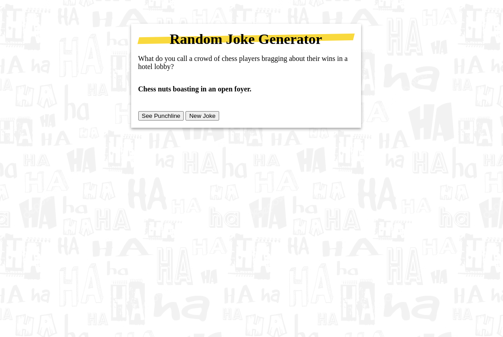

## {{ title }}

A small little project featuring the browser fetch API and async/await functions. Upon clicking the new joke button, a fetch call is made to https://official-joke-api.appspot.com/jokes/random which returns a new joke setup and punchline. The setup is displayed and some JS/CSS is used to display the joke punchline.

[Visit Site]({{link}})
